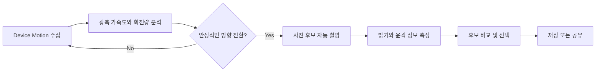

<div align="center">
  

  <h1>FOCHAK</h1>

  <p><strong>흔드는 순간, 음식의 역동적인 한 컷을 포착하다.</strong></p>

  <p>아이폰의 움직임을 감지해 가장 역동적인 순간을 자동으로 촬영하는 iOS 카메라 앱</p>

  <br />

  
  
  
</div>

---

## 소개

FOCHAK은 휴대폰을 음식과 평행하게 잡고 위아래로 움직이면, **방향이 전환되는 순간을 감지해 자동으로 사진을 촬영**합니다. 사용자는 여러 후보 중 마음에 드는 사진만 골라 저장하거나 바로 공유할 수 있습니다.

<p align="center">
  
  &nbsp;&nbsp;&nbsp;
  
</p>

## 주요 기능

| 기능 | 설명 |
| --- | --- |
| 움직임 기반 자동 촬영 | Device Motion을 분석해 휴대폰의 이동 방향이 바뀌는 순간을 포착합니다. |
| 다양한 촬영 설정 | 렌즈, 노출, 초점, 화이트밸런스, 화질, 화면 비율을 조절할 수 있습니다. |
| 후보 사진 비교 | 한 번의 세션에서 여러 후보를 만들고 원하는 사진을 선택할 수 있습니다. |
| 촬영 앨범 | 촬영 세션별 결과를 앱 안에 보관하고 다시 확인할 수 있습니다. |
| 저장 및 공유 | 선택한 사진을 사진 앱에 저장하거나 공유 시트와 Instagram Story로 보낼 수 있습니다. |
| 촬영 피드백 | 햅틱과 상태 메시지로 포착 및 처리 상태를 알려줍니다. |

## 사용 방법

1. 음식이 화면 중앙에 오도록 휴대폰을 평행하게 잡습니다.
2. 촬영을 시작한 뒤 휴대폰을 음식 쪽으로 가까이 움직입니다.
3. 다시 멀어지는 방향으로 전환하면 앱이 순간을 감지해 자동으로 촬영합니다.
4. 촬영을 마치고 후보 사진을 비교합니다.
5. 마음에 드는 사진을 선택해 저장하거나 공유합니다.

> [!IMPORTANT]
> 카메라, 토치, Device Motion은 시뮬레이터에서 정상적으로 검증할 수 없습니다. 실제 iPhone에서 실행해 주세요.

## 실행하기

### 요구 사항

- macOS 및 Xcode
- iOS 26.0 이상을 실행하는 실제 iPhone
- 카메라와 Device Motion을 지원하는 기기

### 설치

```bash
git clone https://github.com/s2vene/ExtremeFoodShot.git
cd ExtremeFoodShot
open ExtremeFoodShot.xcodeproj
```

Xcode에서 다음 순서로 실행합니다.

1. `ExtremeFoodShot` 스킴을 선택합니다.
2. **Signing & Capabilities**에서 본인의 Development Team을 설정합니다.
3. 연결된 iPhone을 실행 대상으로 선택합니다.
4. 앱을 빌드하고 카메라, 동작 및 사진 추가 권한을 허용합니다.

## 동작 원리



- `MotionAnalyzer`가 100Hz로 기기 움직임을 수집합니다.
- 광축 가속도와 회전량을 바탕으로 안정적인 방향 전환을 감지합니다.
- `CameraService`가 고화질 사진 또는 전후 버퍼 프레임을 후보로 생성합니다.
- 밝기, 윤곽 에너지, 움직임 점수를 이용해 후보를 비교합니다.

## 기술 스택

- **UI** — SwiftUI
- **Camera** — AVFoundation, Core Image
- **Motion** — Core Motion
- **Photo Library** — Photos
- **Feedback** — Core Haptics
- **Architecture** — MVVM

## 프로젝트 구조

```text
ExtremeFoodShot/
├── Models/         # 촬영 후보와 앨범 데이터 모델
├── Services/       # 카메라, 모션, 앨범, 햅틱 및 공유 기능
├── ViewModels/     # 촬영 세션 상태와 비즈니스 로직
├── Views/          # 카메라, 결과, 앨범, 온보딩 화면
└── ExtremeFoodShotApp.swift
Resource/           # 이미지, 색상, 폰트 및 앱 설정
```

## 촬영 실험과 튜닝

렌즈와 노출 프리셋, 자동 촬영 방식, 모션 임계값 등을 비교하려면 [TESTING.md](TESTING.md)를 참고해 주세요. 같은 조건에서 반복 촬영하며 자동 포착 성공률과 블러, 노출 결과를 검증할 수 있습니다.

## 권한 안내

FOCHAK은 기능 제공을 위해 아래 권한을 사용합니다.

| 권한 | 사용 목적 |
| --- | --- |
| 카메라 | 음식 사진 촬영 |
| 동작 및 피트니스 | 자동 촬영 순간 판단 |
| 사진 추가 | 선택한 결과를 사진 앱에 저장 |

촬영 데이터와 앨범은 기기 내부에서 관리됩니다.

---

<div align="center">
  Made with SwiftUI for a more dynamic food shot.
</div>
